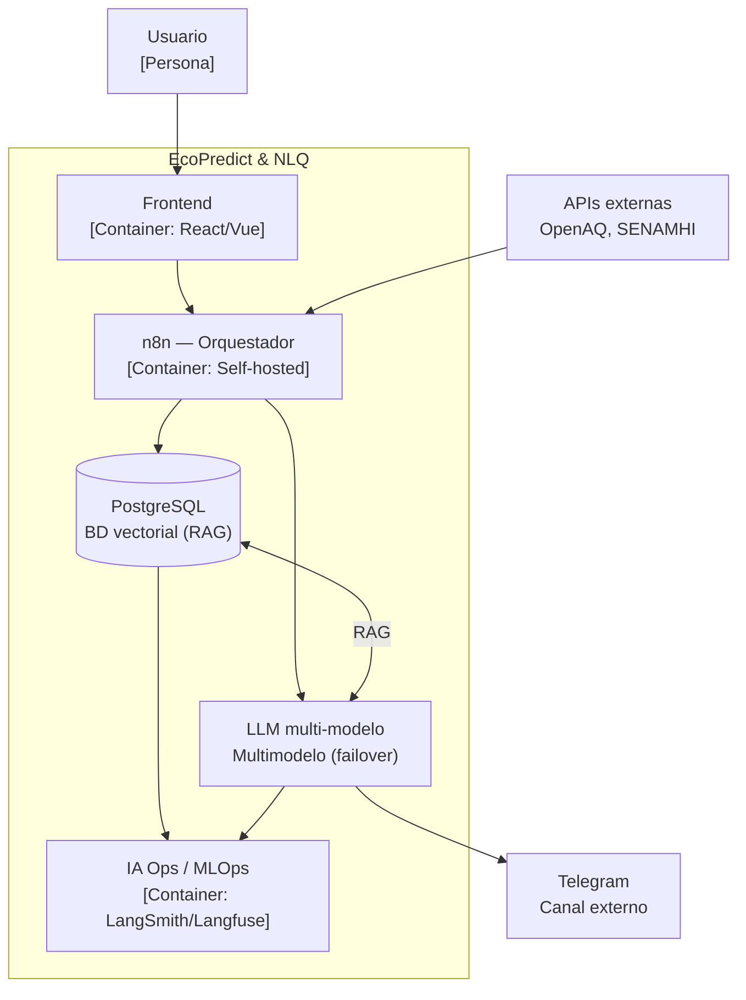
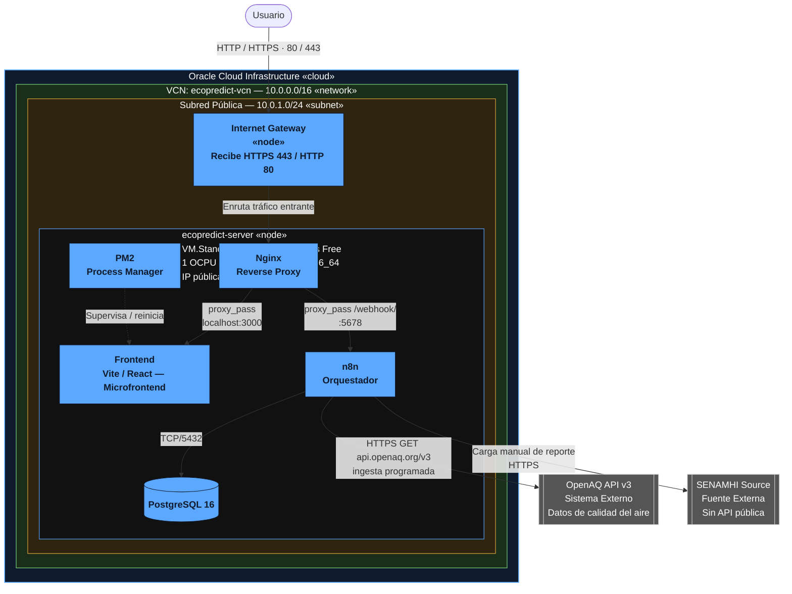
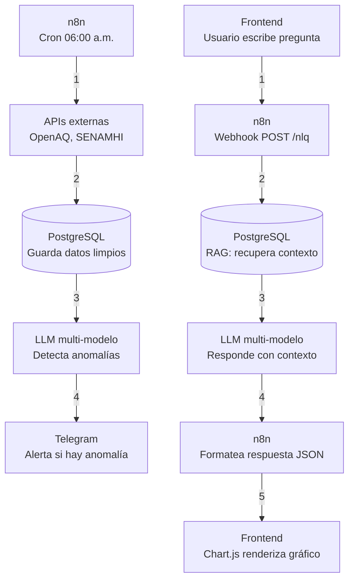

# EcoPredict & NLQ

**Sistema de Alerta e Investigación Ambiental Ciudadana**

EcoPredict & NLQ es un sistema orientado al análisis de información ambiental mediante **Open Data, automatización, Inteligencia Artificial y consultas en lenguaje natural (NLQ)**.

## Objetivo

- Integrar fuentes de datos ambientales.
- Automatizar la ingesta y procesamiento de información.
- Utilizar IA para detectar patrones y anomalías.
- Permitir consultas mediante lenguaje natural.
- Aplicar buenas prácticas de **DevSecOps**.

---

## Arquitectura del Sistema - EcoPredict & NLQ


## 🚀 Diagrama de Despliegue — EcoPredict & NLQ en OCI

Representación de la infraestructura desplegada en **Oracle Cloud Infrastructure (OCI)**, mostrando la red, el nodo de cómputo, los servicios internos y las integraciones externas.



## Diagrama de Flujos



## 📁 Estructura principal

```text
├── .github/
│   ├── PULL_REQUEST_TEMPLATE.md
│   └── workflows/
│
├── src/
│   ├── frontend/
│   ├── n8n-workflows/
│   ├── database/
│   └── ia-ops/
│
├── infrastructure/
├── .gitignore
├── LICENSE
└── README.md
```

- `.github/` — Plantillas y workflows de CI/CD.
- `src/frontend/` — Código del frontend.
- `src/n8n-workflows/` — Workflows de n8n.
- `src/database/` — Migraciones y seeders.
- `src/ia-ops/` — Prompts, pruebas y configuración de IA.
- `infrastructure/` — Configuración de infraestructura local.

---

## Uso local

El proyecto se encuentra actualmente en fase de **estructuración y configuración**.

Los requisitos y pasos de ejecución de cada componente se documentarán conforme avance la integración.

Las variables de entorno deberán basarse en:

```text
infrastructure/.env.example
```

No se deben subir archivos `.env` reales.

---

## Gobernanza y seguridad

- `main` será la rama principal y estará protegida.
- Los cambios deberán realizarse mediante **Pull Requests**.
- Todo PR deberá pasar las validaciones automáticas.
- Los desarrolladores trabajarán en ramas independientes.
- No se deben incluir credenciales, tokens ni secretos en el repositorio.
- Los workflows de n8n deberán revisarse antes de incorporarse.
- Las validaciones de calidad y seguridad se automatizarán mediante **GitHub Actions**.

---

## Estado

Fase actual: Implementación e integración de la solución.

El proyecto se encuentra en proceso de implementación e integración de sus componentes de infraestructura, backend, n8n, base de datos, QA, seguridad, automatización CI/CD y frontend, de acuerdo con las tareas definidas para el desarrollo de la solución.
