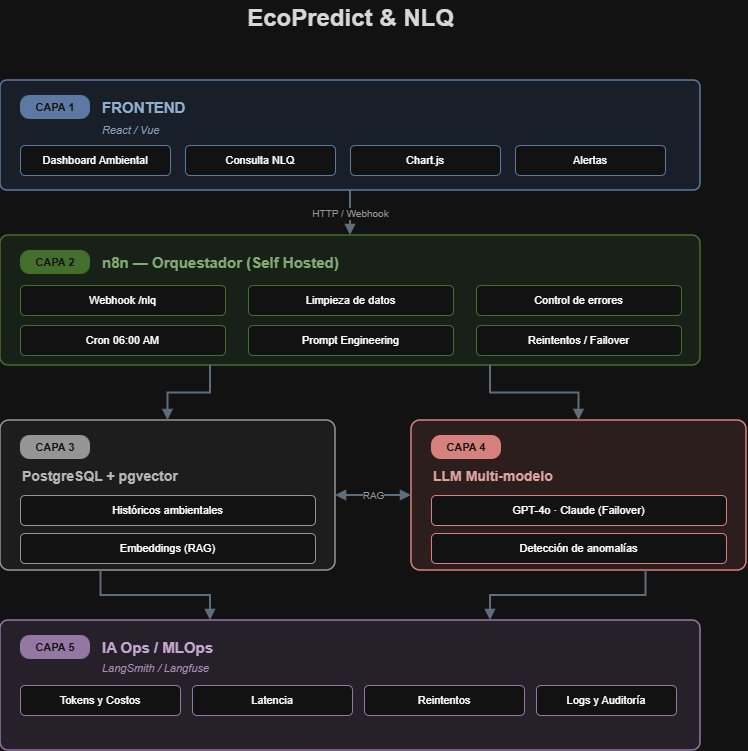
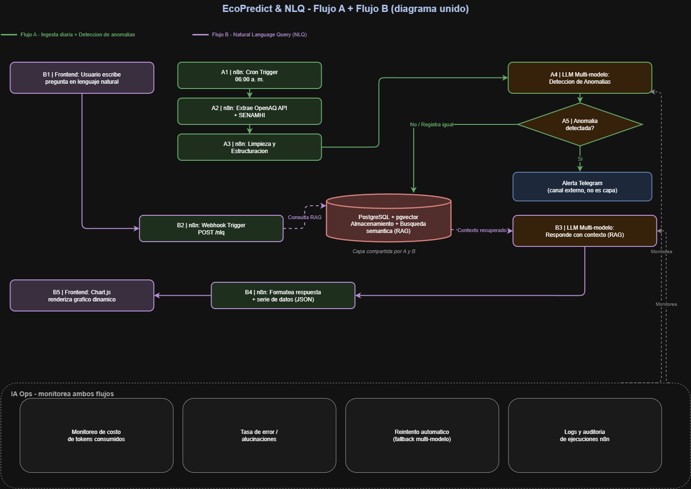

# 🏛️ Arquitectura del Sistema - EcoPredict & NLQ

Este documento describe la arquitectura técnica en **5 capas** y los **2 flujos de datos principales** que integran la plataforma **EcoPredict & NLQ**.

---

## 1. Arquitectura de 5 Capas

El sistema se estructura modularmente en 5 capas para garantizar alta escalabilidad, desacoplamiento y facilidades de observabilidad.

### Descripciones de las Capas:
1. **Capa 1 | Frontend (React / Vue):** Interfaz para el usuario final. Alberga el Dashboard Ambiental, los módulos de consulta en lenguaje natural (NLQ), renderización de gráficos con **Chart.js** y recepción de alertas.
2. **Capa 2 | n8n - Orquestador (Self Hosted):** Motor de integración y flujos de automatización. Gestiona triggers (Webhook `/nlq` y Cron Jobs), limpieza de datos, Prompt Engineering, manejo de errores y lógica de reintentos (*failover*).
3. **Capa 3 | PostgreSQL + pgvector:** Capa de almacenamiento unificado. Guarda los históricos ambientales estructurados y los *embeddings* vectoriales para búsquedas semánticas (RAG).
4. **Capa 4 | LLM Multi-modelo:** Motor de Inteligencia Artificial que soporta modelos como GPT-4o y Claude (con soporte de conmutación en caso de fallo). Realiza tareas de detección de anomalías y respuestas conversacionales.
5. **Capa 5 | IA Ops / MLOps (LangSmith / Langfuse):** Capa transversal de observabilidad. Monitorea uso de tokens, costos, latencia, tasa de errores/alucinaciones y auditoría general de ejecuciones.

---

## 2. Diagrama de Flujos de Información (Flujo A y Flujo B)

El siguiente diagrama detalla la interacción paso a paso entre componentes para la ingesta automatizada y la consulta conversacional.

---

### 🔄 Flujo A: Ingesta Diaria + Detección de Anomalías

Este flujo se ejecuta en segundo plano como un proceso *batch* programado:

1. **A1 (Cron Trigger):** Se activa automáticamente a las **06:00 a.m.** en n8n.
2. **A2 (Extracción de Datos):** n8n consulta las API externas de **OpenAQ** y **SENAMHI**.
3. **A3 (Limpieza y Estructuración):** n8n limpia y estandariza los datos ambientales recibidos.
4. **A4 (Análisis con LLM):** El LLM analiza los datos limpios en busca de anomalías o picos de contaminación.
5. **A5 (Toma de Decisión & Alertas):**
   * **Persistencia:** Todos los datos se guardan en **PostgreSQL + pgvector**.
   * **Notificación:** Si se detecta una anomalía, se envía una alerta inmediata a un canal de **Telegram**.

---

### 💬 Flujo B: Natural Language Query (NLQ) + RAG

Este flujo responde dinámicamente a las consultas de los usuarios desde la plataforma:

1. **B1 (Entrada de Usuario):** El usuario escribe una pregunta en lenguaje natural en el Frontend.
2. **B2 (Webhook Trigger):** El Frontend envía una petición `POST /nlq` hacia n8n.
3. **B3 (Búsqueda RAG):** n8n realiza una consulta de búsqueda semántica (RAG) en **PostgreSQL + pgvector** para recuperar el contexto histórico relevante.
4. **B4 (Generación con LLM):** El LLM procesa la pregunta junto con el contexto recuperado y genera la respuesta final.
5. **B5 (Formateo & Renderizado):** n8n estructura la respuesta y las series de datos en JSON, y el Frontend las presenta visualmente utilizando **Chart.js**.

---

## 👁️ Monitoreo e IA Ops

Ambos flujos están instrumentados mediante **IA Ops** para garantizar la salud del sistema:
* **Métrica de Costos:** Seguimiento en tiempo real del gasto de tokens.
* **Calidad de Respuestas:** Detección de alucinaciones y tasas de error.
* **Resiliencia:** Reintentos automáticos mediante *fallback* a modelos secundarios.
* **Auditoría:** Registro estructurado (*logs*) de cada ejecución en n8n.