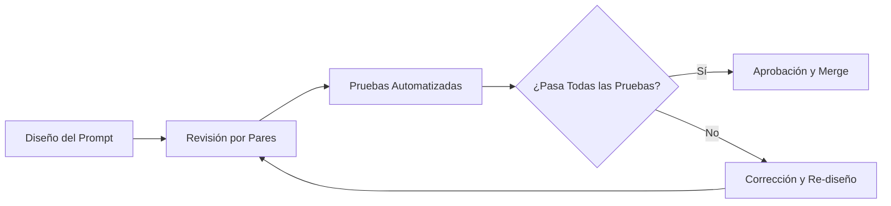

# 🤖 Módulo IA-Ops — EcoPredict-NLQ

> **Sistema de Alerta e Investigación Ambiental Ciudadana**
> Inteligencia Artificial Operacional para Consultas en Lenguaje Natural

---

## 📋 Tabla de Contenidos

- [Propósito](#-propósito)
- [Estructura del Directorio](#-estructura-del-directorio)
- [Requisitos Previos](#-requisitos-previos)
- [Cómo Ejecutar las Pruebas](#-cómo-ejecutar-las-pruebas)
- [Guía de Prompt Engineering](#-guía-de-prompt-engineering)
- [Estrategia de QA](#-estrategia-de-qa)
- [Guía de Contribución](#-guía-de-contribución)
- [Contacto y Soporte](#-contacto-y-soporte)

---

## 🎯 Propósito

El módulo **IA-Ops** es el núcleo de inteligencia artificial del proyecto EcoPredict-NLQ. Su responsabilidad principal es gestionar, evaluar y asegurar la calidad de los **prompts** que permiten a los usuarios realizar consultas ambientales en **lenguaje natural (NLQ)**.

### Funciones Principales

| Función | Descripción |
|---|---|
| **Gestión de Prompts** | Diseño, versionado y mantenimiento de los prompts del sistema |
| **Aseguramiento de Calidad** | Pruebas automatizadas para validar la precisión y seguridad de las respuestas |
| **Observabilidad** | Monitoreo del rendimiento y comportamiento de los modelos de IA |
| **Seguridad** | Detección y prevención de inyecciones de prompts y respuestas maliciosas |

### Casos de Uso del Módulo

El módulo IA-Ops soporta las siguientes capacidades dentro de EcoPredict-NLQ:

- **Consultas Ambientales NLQ**: Traducir preguntas ciudadanas como *"¿Cuál es la calidad del aire en mi zona?"* en consultas estructuradas contra datos abiertos.
- **Alertas Inteligentes**: Generar alertas automatizadas basadas en umbrales ambientales configurables.
- **Análisis Predictivo**: Utilizar modelos de IA para predecir tendencias ambientales a partir de datos históricos.
- **Investigación Ciudadana**: Facilitar el acceso a datos ambientales abiertos mediante interfaces conversacionales.

---

## 📂 Estructura del Directorio

```
src/ia-ops/
├── README.md                          # Este archivo — Documentación del módulo
├── prompts/                           # Directorio de prompts del sistema
│   ├── README.md                      # Documentación de los prompts
│   ├── system_prompt_nlq.txt          # Prompt principal del sistema NLQ
│   ├── prompt_alertas.txt             # Prompt para generación de alertas
│   └── prompt_validacion_datos.txt    # Prompt para validación de datos ambientales
├── tests/                             # Suite de pruebas automatizadas
│   ├── README.md                      # Documentación de las pruebas
│   ├── qa_strategy.md                 # Estrategia completa de QA
│   ├── prompt_evaluation_rubric.md    # Rúbrica de evaluación de prompts
│   ├── test_prompt_quality.py         # Pruebas de calidad de prompts
│   ├── test_prompt_injection.py       # Pruebas de seguridad contra inyecciones
│   ├── test_nlq_accuracy.py           # Pruebas de precisión de respuestas NLQ
│   └── conftest.py                    # Configuración compartida de pytest
└── config-observability/              # Configuración de monitoreo y observabilidad
    ├── README.md                      # Documentación de observabilidad
    ├── dashboards/                    # Definiciones de dashboards de monitoreo
    ├── alerting-rules/                # Reglas de alerta para el sistema
    └── metrics-config.yml             # Configuración de métricas
```

### Descripción de Subdirectorios

#### `prompts/`
Contiene los archivos de prompts versionados que utiliza el sistema NLQ. Cada prompt está diseñado siguiendo las mejores prácticas de prompt engineering y es sometido a revisión de calidad antes de su integración.

#### `tests/`
Suite completa de pruebas automatizadas que validan la calidad, seguridad y precisión de los prompts y las respuestas generadas por el modelo de IA. Las pruebas se ejecutan automáticamente en el pipeline CI/CD mediante el workflow `ai-testing-ci.yml`.

#### `config-observability/`
Configuraciones de monitoreo y observabilidad para rastrear el rendimiento del sistema de IA en producción, incluyendo dashboards, reglas de alertas y configuración de métricas.

---

## ⚙️ Requisitos Previos

### Software Requerido

| Herramienta | Versión Mínima | Propósito |
|---|---|---|
| Python | 3.10+ | Lenguaje de ejecución |
| pip | 22.0+ | Gestor de paquetes |
| pytest | 7.0+ | Framework de pruebas |
| Git | 2.30+ | Control de versiones |

### Instalación de Dependencias

```bash
# Clonar el repositorio
git clone https://github.com/tu-organizacion/EcoPredict-NLQ.git
cd EcoPredict-NLQ

# Crear entorno virtual
python -m venv venv
source venv/bin/activate  # Linux/Mac
# .\venv\Scripts\activate  # Windows

# Instalar dependencias de pruebas
pip install -r requirements-test.txt
```

### Dependencias Principales de Pruebas

```
pytest>=7.0.0
pytest-cov>=4.0.0
pytest-html>=3.2.0
pytest-xdist>=3.0.0
pyyaml>=6.0
jsonschema>=4.0.0
```

---

## 🧪 Cómo Ejecutar las Pruebas

### Ejecución Completa de la Suite

```bash
# Ejecutar todas las pruebas del módulo IA-Ops
pytest src/ia-ops/tests/ -v

# Ejecutar con reporte de cobertura
pytest src/ia-ops/tests/ -v --cov=src/ia-ops --cov-report=html

# Ejecutar con reporte HTML detallado
pytest src/ia-ops/tests/ -v --html=reports/ia-ops-test-report.html
```

### Ejecución por Categoría

```bash
# Solo pruebas de calidad de prompts
pytest src/ia-ops/tests/test_prompt_quality.py -v

# Solo pruebas de seguridad (inyección de prompts)
pytest src/ia-ops/tests/test_prompt_injection.py -v

# Solo pruebas de precisión NLQ
pytest src/ia-ops/tests/test_nlq_accuracy.py -v
```

### Ejecución por Marcadores

```bash
# Pruebas marcadas como críticas
pytest src/ia-ops/tests/ -v -m "critical"

# Pruebas de seguridad
pytest src/ia-ops/tests/ -v -m "security"

# Pruebas de rendimiento
pytest src/ia-ops/tests/ -v -m "performance"
```

### Integración con CI/CD

El workflow `ai-testing-ci.yml` ejecuta automáticamente las pruebas en cada push y pull request. El pipeline:

1. Detecta archivos Python de prueba en `src/ia-ops/tests/`
2. Instala las dependencias necesarias
3. Ejecuta `pytest` con cobertura habilitada
4. Genera reportes de resultados
5. Falla el build si alguna prueba crítica no pasa

---

## 📝 Guía de Prompt Engineering

### Principios Fundamentales

Los prompts del módulo IA-Ops deben seguir estos principios:

#### 1. Claridad y Especificidad
```
✅ CORRECTO: "Analiza los datos de calidad del aire (PM2.5, PM10, O3)
   para la estación {station_id} en el período {date_range} y genera
   un resumen con las tendencias identificadas."

❌ INCORRECTO: "Analiza los datos ambientales."
```

#### 2. Estructura y Formato
Cada prompt debe incluir las siguientes secciones:

| Sección | Obligatoria | Descripción |
|---|---|---|
| **Contexto del Sistema** | ✅ | Define el rol y las capacidades del asistente |
| **Instrucciones Específicas** | ✅ | Detalla las acciones esperadas paso a paso |
| **Formato de Salida** | ✅ | Especifica el formato de la respuesta esperada |
| **Restricciones de Seguridad** | ✅ | Define los límites y prohibiciones del modelo |
| **Ejemplos** | ⚠️ Recomendada | Muestra entradas y salidas de ejemplo (few-shot) |
| **Manejo de Errores** | ⚠️ Recomendada | Indica cómo responder ante datos faltantes o inválidos |

#### 3. Seguridad por Diseño
- **Nunca** incluir credenciales, claves API o información sensible en los prompts.
- **Siempre** incluir instrucciones de rechazo ante solicitudes fuera del dominio ambiental.
- **Siempre** validar que el prompt no sea susceptible a inyecciones.
- **Implementar** guardrails para prevenir la generación de contenido dañino.

#### 4. Versionado de Prompts
- Cada prompt debe tener un identificador único y un número de versión.
- Los cambios en prompts deben documentarse con un changelog.
- Los prompts obsoletos deben marcarse como `deprecated` antes de eliminarse.

### Proceso de Revisión de Prompts



---

## 🛡️ Estrategia de QA

### Visión General

La estrategia de QA del módulo IA-Ops se centra en garantizar que los prompts y las respuestas del sistema NLQ cumplan con los estándares de **calidad**, **seguridad**, **precisión** y **rendimiento** definidos por el proyecto.

### Pilares de la Estrategia

| Pilar | Descripción | Cobertura Objetivo |
|---|---|---|
| **Calidad de Prompts** | Validar la estructura, claridad y coherencia de los prompts | ≥ 90% |
| **Seguridad** | Detectar y prevenir inyecciones de prompts y respuestas maliciosas | 100% |
| **Precisión de Respuestas** | Verificar que las respuestas NLQ sean precisas y relevantes | ≥ 85% |
| **Rendimiento** | Medir tiempos de respuesta y uso de recursos | ≤ 3s por consulta |

### Documentación Detallada

Para la documentación completa de la estrategia de QA, consultar:

- 📄 [`tests/qa_strategy.md`](tests/qa_strategy.md) — Estrategia completa de QA
- 📊 [`tests/prompt_evaluation_rubric.md`](tests/prompt_evaluation_rubric.md) — Rúbrica de evaluación de prompts

---

## 🤝 Guía de Contribución

### Proceso General

1. **Fork** del repositorio y creación de una rama feature: `feature/ia-ops-<descripción>`
2. **Desarrollo** siguiendo las guías de prompt engineering y estándares de código
3. **Pruebas** — Ejecutar la suite completa de pruebas antes de crear el PR
4. **Pull Request** con descripción detallada de los cambios
5. **Revisión** por al menos un miembro del equipo de QA Prompt Engineering
6. **Merge** después de aprobación y pruebas CI exitosas

### Reglas para Contribuir Prompts

| Regla | Descripción |
|---|---|
| Documentación obligatoria | Todo prompt nuevo debe incluir un encabezado con propósito, versión y autor |
| Pruebas obligatorias | Cada prompt nuevo debe tener al menos 5 casos de prueba asociados |
| Revisión de seguridad | Todos los prompts deben pasar la revisión de inyección de prompts |
| Formato estándar | Seguir la plantilla de prompts definida en `prompts/README.md` |
| Idioma | Todo el contenido debe estar en español |

### Reglas para Contribuir Pruebas

- Las pruebas deben ubicarse en `src/ia-ops/tests/`
- Los archivos de prueba deben seguir la convención `test_*.py`
- Cada prueba debe tener un docstring descriptivo en español
- Las pruebas críticas deben marcarse con `@pytest.mark.critical`
- Las pruebas de seguridad deben marcarse con `@pytest.mark.security`

### Convención de Commits

```
feat(ia-ops): agregar prompt para análisis de calidad del agua
fix(ia-ops): corregir validación de formato en prompt de alertas
test(ia-ops): agregar pruebas de inyección para prompt NLQ principal
docs(ia-ops): actualizar documentación de estrategia QA
```

### Estándares de Código Python

```python
"""
Módulo de pruebas para [componente].

Este módulo contiene las pruebas automatizadas que validan
[descripción del alcance de las pruebas].

Autor: [nombre]
Versión: [x.y.z]
Fecha: [YYYY-MM-DD]
"""

import pytest

@pytest.mark.critical
def test_nombre_descriptivo():
    """Verificar que [descripción clara de lo que se prueba]."""
    # Arrange — Preparar datos de entrada
    # Act — Ejecutar la acción
    # Assert — Verificar el resultado esperado
    pass
```

---

## 📞 Contacto y Soporte

| Canal | Uso |
|---|---|
| **GitHub Issues** | Reportar bugs, solicitar mejoras o discutir propuestas |
| **Pull Requests** | Contribuir código, prompts o documentación |
| **Discussions** | Preguntas generales y discusiones de diseño |

---

> **EcoPredict-NLQ** — Democratizando el acceso a datos ambientales mediante IA y consultas en lenguaje natural. 🌍
