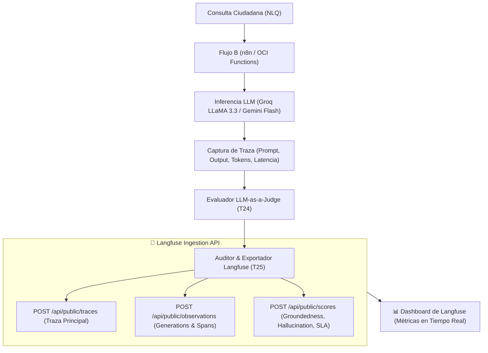

# 🔭 EcoPredict & NLQ — Observabilidad de Inteligencia Artificial con Langfuse (HT-08 / HT-10)

Guía de integración, arquitectura de telemetría y auditoría continua de calidad de IA para el proyecto **EcoPredict & NLQ** mediante la plataforma **Langfuse**.

---

## 📌 Contexto de Historias Técnicas y Tareas

* **Historia Técnica Principal:** `HT-10 (#152): Auditoría de calidad de IA y observabilidad (IA Ops)`
* **Historia Técnica Asociada:** `HT-08: Observabilidad de IA con Langfuse`
* **Tarea:** ✅ **T25 (#185):** *Verificación y auditoría de métricas de calidad de IA contra el dashboard de Langfuse*.

---

## 🏗️ Arquitectura de Telemetría y Observabilidad

El pipeline de observabilidad conecta los flujos de inferencia del bot ambiental (Groq LLaMA 3.3 70B y Google Gemini 1.5 Flash) con el motor evaluador determinista **LLM-as-a-Judge** y la API de ingesta de **Langfuse**:



---

## 📊 Entidades del Modelo de Datos de Langfuse

### 1. Traces (`Traza Principal`)
Representa la sesión completa de consulta del ciudadano:
* `id`: Identificador único (UUID / `TR-XXX`).
* `name`: Nombre de la operación (ej. `nlq_consulta_ambiental`).
* `userId`: Identificador anonimizado del ciudadano o canal (Telegram / Web Chat).
* `sessionId`: Identificador de la sesión de conversación.
* `tags`: Etiquetas taxonómicas (`ecopredict`, `flujo-b`, `fallback-failover`, `qa-audited`).
* `metadata`: Parámetros contextuales (estación consultada, contaminante, índice INCA).

### 2. Generations (`Observación de LLM`)
Representa la llamada específica al modelo de lenguaje:
* `model`: Nombre del modelo ejecutado (`groq-llama-3.3-70b` o `gemini-1.5-flash`).
* `modelParameters`: Temperatura, top_p y max_tokens.
* `input`: Prompt final con contexto RAG inyectado.
* `output`: Respuesta generada por el bot.
* `usage`: Conteo de `promptTokens`, `completionTokens` y `totalTokens`.
* `calculatedCostUsd`: Costo monetario exacto en dólares americanos calculado por token.
* `latencyMs`: Tiempo de inferencia medido en milisegundos.

### 3. Scores (`Métricas de Evaluación`)
Puntajes asignados a la traza por el motor evaluador:
* `groundedness`: Escala de 0.0 a 1.0 (mínimo aceptable: $\ge 0.90$).
* `hallucination_detected`: Booleano (`true` si hubo falsificación numérica o geográfica).
* `latency_sla_breach`: Booleano (`true` si latencia $> 5,000\text{ ms}$).
* `user_relevance`: Escala de 1.0 a 5.0 (mínimo aceptable: $\ge 4.0$).
* `tone_quality`: Escala de 1.0 a 5.0 (empatía y comunicación clara de riesgos).

---

## 💰 Modelo de Costos de Inferencia

| Modelo | Rol en EcoPredict | Costo Input / 1M Tokens | Costo Output / 1M Tokens | SLA Latencia |
|---|---|:---:|:---:|:---:|
| **Groq LLaMA 3.3 70B** | Modelo Principal (Ultra-rápido) | **\$0.59 USD** | **\$0.79 USD** | $< 2,000\text{ ms}$ |
| **Gemini 1.5 Flash** | Modelo de Fallback (Respaldo) | **\$0.075 USD** | **\$0.30 USD** | $< 5,000\text{ ms}$ |

---

## 🚀 Ejecución de Auditoría y Pruebas Automatizadas

```bash
# 1. Ejecutar las pruebas automatizadas de integración con Langfuse (12 tests)
pytest src/ia-ops/tests/test_langfuse_observability.py -v

# 2. Generar reporte consolidado de telemetría y exportación a Langfuse
python -c "import sys; sys.path.insert(0, 'src/ia-ops'); from evaluators.langfuse_auditor import AuditorLangfuse; auditor = AuditorLangfuse(); rep = auditor.auditar_y_exportar_dataset(); print(f'Trazas exportadas: {rep[\"total_trazas_procesadas\"]}, Costo Total: ${rep[\"costo_total_acumulado_usd\"]:.6f} USD')"
```
