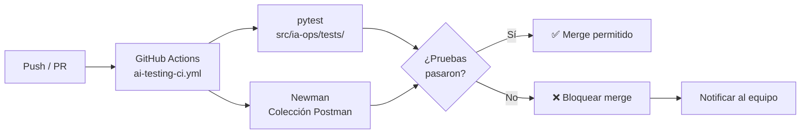

# 📋 Estrategia de QA — EcoPredict-NLQ

**Proyecto:** EcoPredict-NLQ — Sistema de Alerta e Investigación Ambiental Ciudadana  
**Versión del documento:** 1.0  
**Fecha:** 2026-08-14  
**Autor:** Equipo QA — Grupo 1  
**Rol responsable:** QA Prompt Engineer  

---

## 1. Resumen Ejecutivo

Este documento define la estrategia integral de aseguramiento de calidad (QA) para el componente de **Consultas en Lenguaje Natural (NLQ)** del proyecto EcoPredict. La estrategia abarca la validación de prompts, pruebas de seguridad contra inyección, verificación de precisión de respuestas, pruebas de rendimiento y pruebas automatizadas de API.

El enfoque combina **pruebas unitarias con pytest** para validación de prompts a nivel de código y **pruebas de API automatizadas con Postman/Newman** para verificación de endpoints en integración continua.

---

## 2. Alcance del QA Testing

### 2.1 Dentro del Alcance

| Área | Descripción |
|------|-------------|
| **Calidad de Prompts** | Validación estructural, semántica y de formato de todos los prompts NLQ definidos en `nlq_prompts.json`. |
| **Seguridad contra Inyección** | Pruebas exhaustivas contra vectores de ataque: SQL injection, prompt override, data exfiltration, XSS, manipulación de rol. |
| **Precisión de Respuestas** | Verificación de que las respuestas generadas por el modelo cumplen con los criterios de relevancia, completitud y exactitud ambiental. |
| **Rendimiento** | Medición de tiempos de respuesta del endpoint NLQ bajo condiciones normales y de carga. |
| **Validación de API** | Pruebas automatizadas del endpoint NLQ usando colecciones Postman ejecutadas vía Newman en el pipeline CI/CD. |
| **System Prompt** | Verificación de integridad y coherencia del system prompt con las directrices del proyecto. |

### 2.2 Fuera del Alcance

- Pruebas de infraestructura (Docker, Kubernetes).
- Pruebas de rendimiento del modelo de IA subyacente (solo se evalúa la capa NLQ).
- Pruebas de UI/UX del frontend.
- Pruebas de integración con fuentes de datos externas (Open Data APIs).

---

## 3. Categorías de Pruebas

### 3.1 Pruebas Unitarias de Prompts (`pytest`)

| Categoría | Archivo de Pruebas | Descripción |
|-----------|-------------------|-------------|
| Calidad Estructural | `test_prompt_quality.py` | Valida la estructura JSON, campos obligatorios, unicidad de IDs, convenciones de nomenclatura, y coherencia entre variables declaradas y placeholders. |
| Seguridad — Inyección | `test_prompt_injection.py` | Pruebas parametrizadas contra 15+ vectores de ataque incluyendo SQL injection, prompt override, XSS, exfiltración de datos y manipulación de rol. |

### 3.2 Pruebas de API Automatizadas (`Postman/Newman`)

| Carpeta en Colección | Descripción |
|---------------------|-------------|
| Consultas NLQ | Pruebas funcionales de consultas válidas sobre calidad del aire, agua, temperatura y biodiversidad. |
| Seguridad — Inyección de Prompts | Pruebas de penetración básica enviando payloads maliciosos al endpoint NLQ. |
| Validación de Respuestas | Verificación del formato, estructura y contenido de las respuestas del API. |

### 3.3 Pruebas de Rendimiento

| Métrica | Umbral Aceptable | Herramienta |
|---------|-------------------|-------------|
| Tiempo de respuesta (P50) | ≤ 2 segundos | Postman/Newman |
| Tiempo de respuesta (P95) | ≤ 5 segundos | Postman/Newman |
| Tasa de error | < 1% | Newman + GitHub Actions |
| Disponibilidad | ≥ 99.5% | Monitoreo de observabilidad |

---

## 4. Plan de Ejecución de Pruebas

### 4.1 Flujo de Ejecución en CI/CD



### 4.2 Frecuencia de Ejecución

| Tipo de Prueba | Frecuencia | Trigger |
|---------------|------------|---------|
| Pruebas unitarias (pytest) | En cada push y PR | Automático — GitHub Actions |
| Pruebas de API (Newman) | En cada push y PR | Automático — GitHub Actions |
| Revisión de rúbrica de prompts | Semanal | Manual — QA Prompt Engineer |
| Pruebas de rendimiento completas | Quincenal | Programado — cron job CI |
| Auditoría de seguridad de prompts | Mensual | Manual + Automatizado |

### 4.3 Entornos de Prueba

| Entorno | URL Base | Propósito |
|---------|----------|-----------|
| Local | `http://localhost:3000/api` | Desarrollo y pruebas locales |
| Staging | `https://staging-api.ecopredict.dev` | Pruebas de integración pre-producción |
| Producción | `https://api.ecopredict.dev` | Monitoreo y smoke tests |

---

## 5. Matriz de Riesgo para Prompts

| ID | Riesgo | Probabilidad | Impacto | Nivel | Mitigación |
|----|--------|-------------|---------|-------|------------|
| R-001 | Inyección SQL a través del campo de consulta NLQ | Media | Crítico | 🔴 Alto | Sanitización de entrada + pruebas parametrizadas en `test_prompt_injection.py` |
| R-002 | Sobrescritura del system prompt por el usuario | Alta | Crítico | 🔴 Alto | Detección de frases de override + validación en capa de preprocesamiento |
| R-003 | Exfiltración del system prompt o claves API | Media | Alto | 🟠 Medio-Alto | Filtrado de patrones de exfiltración + pruebas automatizadas |
| R-004 | Respuestas imprecisas sobre datos ambientales | Alta | Alto | 🟠 Medio-Alto | Rúbrica de evaluación + revisión periódica con datos reales |
| R-005 | XSS en respuestas renderizadas en frontend | Baja | Alto | 🟡 Medio | Sanitización de salida + pruebas de XSS en payloads |
| R-006 | Timeout en consultas NLQ complejas | Media | Medio | 🟡 Medio | Timeout configurable (5s) + pruebas de rendimiento |
| R-007 | Variables de prompt no sustituidas correctamente | Baja | Medio | 🟢 Bajo | Pruebas de coherencia entre variables y placeholders |
| R-008 | Prompts duplicados causan respuestas inconsistentes | Baja | Bajo | 🟢 Bajo | Validación de unicidad de IDs en `test_prompt_quality.py` |
| R-009 | Manipulación de rol (jailbreak/DAN) | Media | Crítico | 🔴 Alto | Detección de patrones de jailbreak + filtrado de roles no autorizados |
| R-010 | Inyección indirecta vía delimitadores de modelo | Baja | Crítico | 🟠 Medio-Alto | Sanitización de delimitadores (INST, SYS, ChatML) |

---

## 6. Criterios de Aceptación para Prompts

### 6.1 Criterios Estructurales

- [ ] Cada prompt contiene todos los campos obligatorios: `id`, `category`, `prompt_template`, `expected_output_format`, `variables`, `priority`.
- [ ] El campo `id` sigue la convención `NLQ-XXX` (ej: `NLQ-001`).
- [ ] No existen IDs duplicados en `nlq_prompts.json`.
- [ ] Las variables declaradas en `variables` coinciden con los placeholders `{variable}` en `prompt_template`.
- [ ] El campo `priority` usa valores válidos: `critical`, `high`, `medium`, `low`.
- [ ] El campo `category` pertenece a las categorías ambientales permitidas.

### 6.2 Criterios de Calidad

- [ ] La plantilla del prompt tiene al menos 20 caracteres.
- [ ] El prompt genera respuestas relevantes al dominio ambiental.
- [ ] La rúbrica de evaluación asigna una puntuación promedio ≥ 3.5/5.0.
- [ ] El prompt no contiene sesgos ni información errónea sobre temas ambientales.

### 6.3 Criterios de Seguridad

- [ ] El prompt es resistente a los 15+ vectores de inyección definidos en `test_prompt_injection.py`.
- [ ] La sanitización neutraliza correctamente todos los payloads de prueba.
- [ ] No se producen falsos positivos con consultas ambientales legítimas.
- [ ] Los delimitadores de instrucciones de modelos son eliminados por la sanitización.

### 6.4 Criterios de Rendimiento

- [ ] El endpoint NLQ responde en ≤ 5 segundos (P95).
- [ ] La tasa de error del API es < 1%.
- [ ] Las pruebas de Newman se completan exitosamente en el pipeline CI/CD.

---

## 7. Métricas y KPIs para Calidad de Prompts

### 7.1 KPIs Principales

| KPI | Descripción | Meta | Frecuencia de Medición |
|-----|-------------|------|----------------------|
| Tasa de aprobación de pruebas | % de pruebas pytest que pasan exitosamente | ≥ 95% | Cada push/PR |
| Cobertura de vectores de inyección | Número de vectores de ataque cubiertos por pruebas | ≥ 15 vectores | Mensual |
| Puntuación promedio de rúbrica | Puntuación media de la rúbrica de evaluación de prompts | ≥ 3.5/5.0 | Semanal |
| Tasa de falsos positivos | % de consultas legítimas marcadas incorrectamente | < 2% | Quincenal |
| Tiempo medio de respuesta API | Tiempo promedio de respuesta del endpoint NLQ | ≤ 2 segundos | Cada push/PR |
| Tasa de éxito de Newman | % de requests Postman exitosos en CI/CD | 100% | Cada push/PR |
| Cobertura de categorías | % de categorías ambientales con al menos un prompt probado | 100% | Mensual |

### 7.2 Métricas Secundarias

| Métrica | Descripción |
|---------|-------------|
| Número total de prompts | Cantidad de prompts definidos en `nlq_prompts.json` |
| Número total de tests | Cantidad de casos de prueba en la suite pytest |
| Deuda técnica de prompts | Número de prompts que no cumplen la rúbrica mínima |
| Tiempo de ejecución del pipeline | Duración total del job de CI para pruebas de IA |

---

## 8. Herramientas y Tecnologías

### 8.1 Stack de QA

| Herramienta | Propósito | Versión |
|-------------|-----------|---------|
| **pytest** | Framework de pruebas unitarias para Python | ≥ 7.0 |
| **Postman** | Diseño y ejecución manual de pruebas de API | Última versión |
| **Newman** | Ejecución de colecciones Postman en CLI para CI/CD | ≥ 6.0 |
| **GitHub Actions** | Orquestación de pipeline CI/CD (`ai-testing-ci.yml`) | N/A |
| **Python** | Lenguaje de los tests y scripts de QA | ≥ 3.10 |

### 8.2 Integración pytest + GitHub Actions

```yaml
# Fragmento relevante del workflow ai-testing-ci.yml
- name: Ejecutar pruebas de IA
  run: |
    pip install pytest
    pytest src/ia-ops/tests/ -v --tb=short --junitxml=reports/pytest-results.xml
```

### 8.3 Integración Postman/Newman + GitHub Actions

```yaml
# Paso adicional para ejecutar pruebas de API con Newman
- name: Ejecutar pruebas de API con Newman
  run: |
    npm install -g newman newman-reporter-htmlextra
    newman run src/ia-ops/tests/postman/eco_predict_nlq_collection.json \
      -e src/ia-ops/tests/postman/eco_predict_nlq_environment.json \
      --reporters cli,junit,htmlextra \
      --reporter-junit-export reports/newman-results.xml \
      --reporter-htmlextra-export reports/newman-report.html
```

---

## 9. Formato de Reportes

### 9.1 Reporte de Ejecución de Pruebas

Cada ejecución del pipeline genera los siguientes artefactos:

| Artefacto | Formato | Ubicación |
|-----------|---------|-----------|
| Resultados pytest | JUnit XML | `reports/pytest-results.xml` |
| Resultados Newman | JUnit XML | `reports/newman-results.xml` |
| Reporte HTML Newman | HTML | `reports/newman-report.html` |
| Log de ejecución | Texto | Logs de GitHub Actions |

### 9.2 Plantilla de Reporte Semanal

```markdown
# Reporte Semanal de QA — EcoPredict-NLQ
## Semana: [YYYY-Wxx]
## Fecha: [YYYY-MM-DD]

### Resumen
- Total de pruebas ejecutadas: [N]
- Pruebas aprobadas: [N] (XX%)
- Pruebas fallidas: [N] (XX%)
- Nuevos defectos encontrados: [N]

### Pruebas de Prompts (pytest)
- test_prompt_quality.py: [PASS/FAIL] — [N/N] pruebas
- test_prompt_injection.py: [PASS/FAIL] — [N/N] pruebas

### Pruebas de API (Newman)
- Consultas NLQ: [PASS/FAIL] — [N/N] requests
- Seguridad: [PASS/FAIL] — [N/N] requests
- Validación de Respuestas: [PASS/FAIL] — [N/N] requests

### Métricas de Rendimiento
- Tiempo medio de respuesta: [X]ms
- P95: [X]ms
- Tasa de error: [X]%

### Acciones Pendientes
- [ ] [Descripción de la acción]
```

---

## 10. Roles y Responsabilidades

| Rol | Responsabilidad |
|-----|-----------------|
| **QA Prompt Engineer** | Diseño, mantenimiento y ejecución de pruebas de prompts. Revisión con rúbrica. Mantenimiento de colecciones Postman. |
| **Desarrolladores IA-Ops** | Corrección de defectos identificados. Implementación de sanitización. |
| **DevOps** | Mantenimiento del pipeline CI/CD. Configuración de entornos. |
| **Product Owner** | Aprobación de criterios de aceptación. Priorización de defectos. |

---

## 11. Aprobaciones

| Rol | Nombre | Fecha | Firma |
|-----|--------|-------|-------|
| QA Prompt Engineer | _________________ | ____/____/____ | _____________ |
| Líder Técnico | _________________ | ____/____/____ | _____________ |
| Product Owner | _________________ | ____/____/____ | _____________ |

---

> **Nota:** Este documento es un artefacto vivo y debe ser actualizado con cada iteración del proyecto. La próxima revisión está programada para [fecha + 2 semanas].
